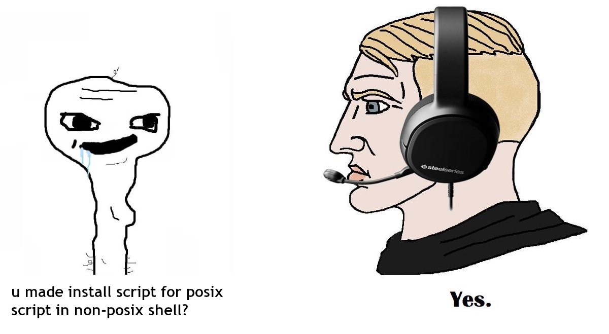

# Touhou Setup

This script will create a .desktop launcher and run script for your touhou games.

## Install

```
git clone https://github.com/eylles/touhou-setup
cd touhou-setup
chmod +x ./install.sh
./install.sh
```
The install script will locate the tuhustp scripr in the $HOME/.local/bin/ directory and add it to PATH in .bashrc IF it ain't already added to PATH in your system, if you have a different dedicated scripts directory already added to PATH just go there in a terminal and run:
```
wget https://raw.githubusercontent.com/eylles/touhou-setup/master/tuhustp
chmod +x tuhustp
```

## How To Use

just open a terminal and run the script
```
tuhustp
```
be sure you are located in ~ if not just run ``cd ~``, make sure your trash directory doesn't contain any of the .exe nor the icons
The script will find all your official touhou pc games and will proceed to create launchers for them, these launchers will be located in ``~/.local/share/applications`` so that your applications menu can find them, it won't create launchers in the desktop directory however it will create run scrips in ``~/.local/bin``, the script will preffer english patched executables and it looks for a naming scheme like ``th09.exe`` and ``th09e.exe`` it will only look in the $HOME directory.


The script can also create the .png icons for the games if you don't have them, just install icoutils and re-run the script
icoutils is present in the official repos for most distros
for ubuntu/debian and derivates:
```
sudo apt install icoutils
```

for arch and derivates:
```
sudo pacman -S icoutils
```

## Posible problems

The script can find a problem if some directory in your $HOME directory has the wrong persmissions and may output something like ``find: './.cache/dconf': Permission denied``, the most likely cause for it is that some GUI application with sudo modified a file and messed up some file ownerships, to fix it just run:
```
sudo chown -R $USER ~
```
after that just re-run the script and everything will work as intended

## Okay, but why tho?

- opening a file explorer just to play your games is a hassle when you can simply have an icon in your desktop or app menu that will run the game with a click
- manually creating a .desktop launcher is also a hassle if you have more than one game you play
- with some games if the command to execute in the .desktop looks like this ``Exec= wine "/path/to/your/game/th.exe"`` the game will start without music
- lazyness, who has the time and drive to do all this manually




## TODO

[ ] improve filename search: as you can see the script will only recognize a handful of file names, and seems it doesn't like the filenames created by thcrap so ¯\\_(ツ)_/¯ .

[ ] improve variable naming scheme: some people have told me the names of the variables are unintuitive at best...
